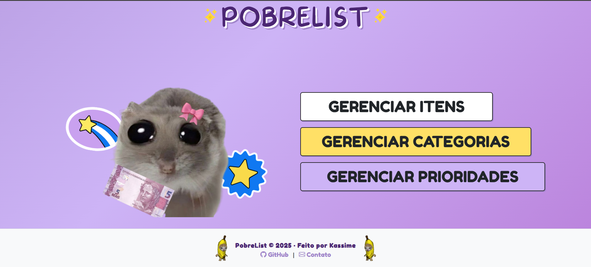
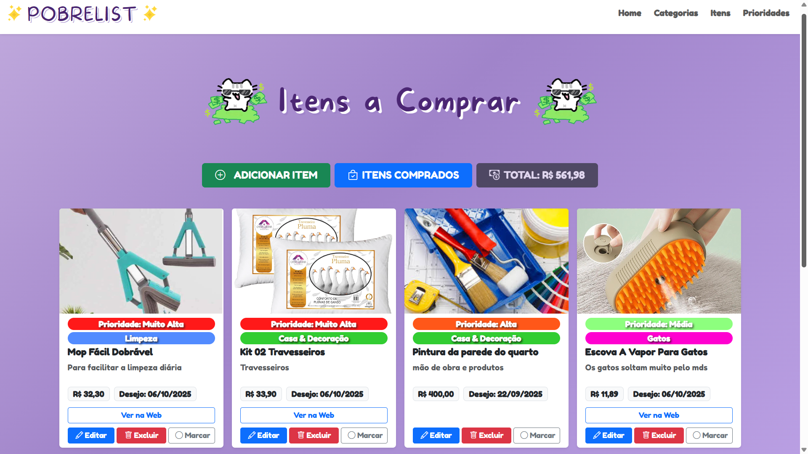
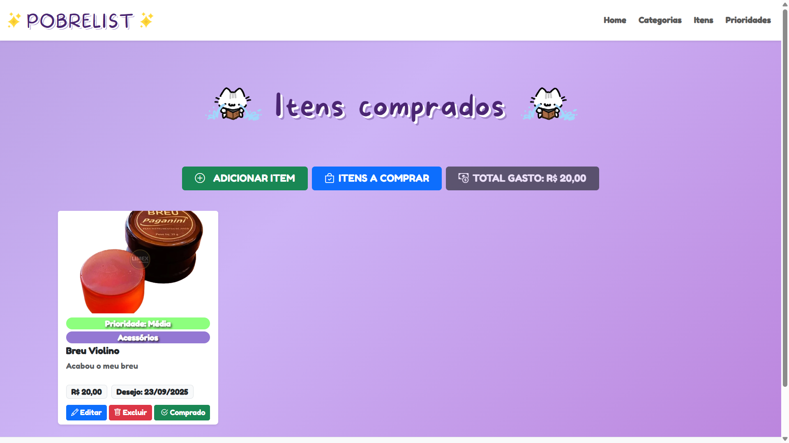
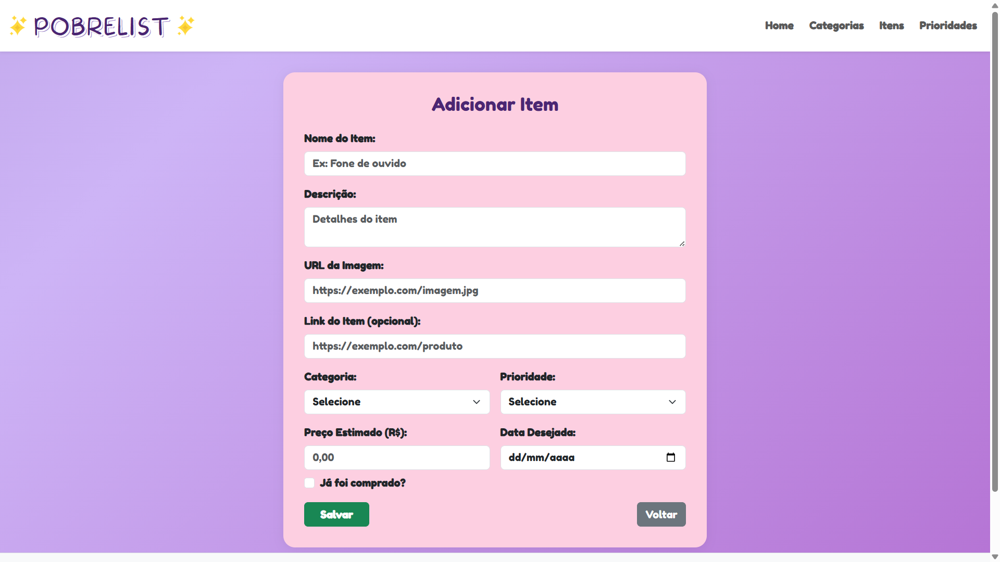
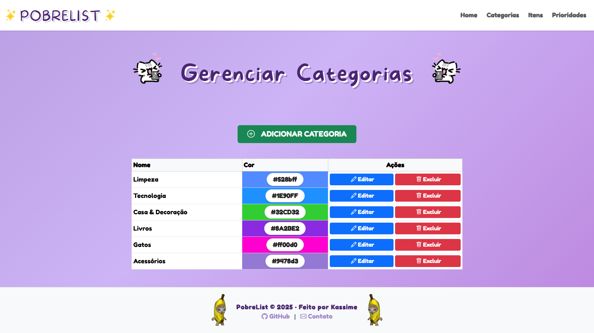

# PobreList

PobreList é um sistema web para gerenciamento de lista de desejos, desenvtelasvido como projeto acadêmico utilizando PHP (MVC), MySQL e Bootstrap. O objetivo é proporcionar uma experiência simples, intuitiva e eficiente para organizar e priorizar itens desejados.

---

## 🚀 Funcionalidades

- **CRUD completo** para Itens, Categorias e Prioridades
- Marcação de itens como comprados ou pendentes
- Interface responsiva e moderna com Bootstrap
- Visualização separada de itens comprados e a comprar

---

## 🛠️ Tecnologias Utilizadas

- **Backend:** PHP 8+, padrão MVC DAO
- **Banco de Dados:** MySQL
- **Frontend:** Bootstrap 5, HTML5, CSS3
- **Outros:** Ícones Bootstrap

---

## 📸 Telas da Aplicação

### Tela Inicial (Home)


### Listagem de Itens


### Itens Comprados


### Cadastro/Alteração de Item


### Listagem de Categorias


### Listagem de Prioridades


---

## ⚙️ Como Executar

1. Clone o repositório:
   ```bash
   git clone https://github.com/GiKassime/PobreList.git
   ```
2. Acesse a pasta do projeto:
   ```bash
   cd PobreList
   ```
3. Configure o arquivo `config.php` com as credenciais do seu banco de dados.
4. Importe o banco de dados presente na pasta `database` para o seu MySQL.
5. Acesse o sistema pelo navegador: [http://localhost:80](http://localhost:80)


## 📞 Contato

- **EMAIL** - (mailto:giovana.kassime.tds2023@gmail.com)
- **GitHub:** [GiKassime](https://github.com/GiKassime)
- **LinkedIn:** [Giovana Kassime](https://www.linkedin.com/in/giovana-kassime-9849141a1/)
